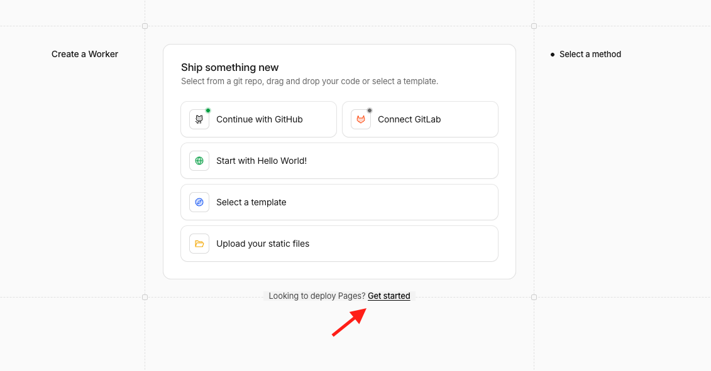
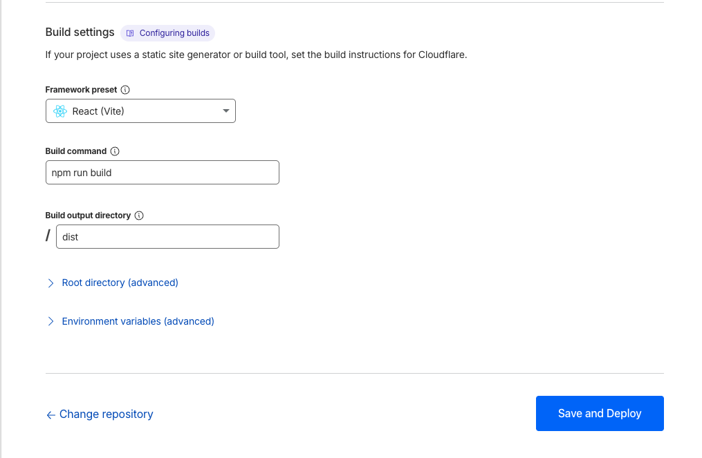
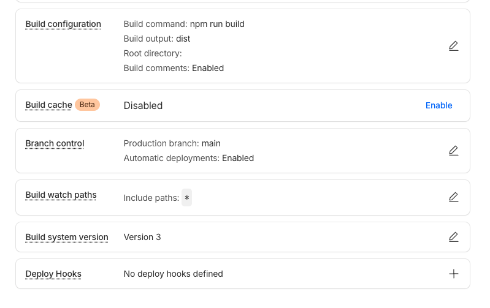

# Guida passo passo: Deploy su Cloudflare Pages

> Cloudflare Pages serve **solo il frontend statico** (output di `vite build`). Il backend (database, RLS, edge functions `generate-vacation-plan` e `sync-jesolo-data`) continua a girare su Supabase e si deploya separatamente.

---

## Prerequisiti

- Repo GitHub con il branch `main` come branch di produzione.
- Account Cloudflare con accesso a **Workers & Pages**.
- Progetto Supabase già attivo con i valori presenti nel file `.env`:
  - `VITE_SUPABASE_PROJECT_ID`
  - `VITE_SUPABASE_PUBLISHABLE_KEY` (anon key — non sensibile)
  - `VITE_SUPABASE_URL`
- Node 18+ (richiesto da Vite 5). Cloudflare Pages lo fornisce di default con Build system version 3.

---

## Step 1 — Creare una nuova applicazione Pages

1. Nella dashboard di Cloudflare, espandi il menu a sinistra sotto **Build**.
2. Clicca su **Workers & Pages**.
3. Clicca sul pulsante **Create application**.
4. Si apre la pagina "Ship something new".
5. In fondo alla pagina trovi la riga **"Looking to deploy Pages? Get started"** — clicca **Get started**.



> In alternativa puoi cliccare direttamente sul tab **Pages** se viene mostrato in cima alla pagina.

---

## Step 2 — Collegare il repository GitHub

1. Nella schermata Pages, scegli **Continue with GitHub** (o GitLab se il repo è lì).
2. Autorizza la **Cloudflare Pages GitHub App** sul tuo account/organizzazione.
3. Seleziona il repository di Wizart dall'elenco.
4. Clicca **Begin setup**.

---

## Step 3 — Configurare la build e avviare il deploy

Nella schermata **"Set up builds and deployments"** compila i campi come segue:

| Campo | Valore |
|---|---|
| **Framework preset** | `React (Vite)` |
| **Production branch** | `main` |
| **Build command** | `npm run build` |
| **Build output directory** | `dist` |




Clicca **Save and Deploy** per avviare il primo deploy.

---

## Step 4 — Verifica della configurazione finale

Al termine del deploy, vai su **Settings → Build** del progetto Pages.  
La configurazione dovrebbe apparire così:

| Voce | Valore |
|---|---|
| Build command | `npm run build` |
| Build output | `dist` |
| Build comments | Enabled |
| Build cache | Disabled |
| Production branch | `main` |
| Automatic deployments | **Enabled** |
| Build watch paths | `*` |
| Build system version | Version 3 |



Con **Automatic deployments: Enabled**, ogni `git push origin main` avvia questo flusso:

1. GitHub manda un webhook a Cloudflare.
2. Cloudflare clona il repo al commit pushato (`.env` incluso).
3. Esegue `npm install`.
4. Esegue `npm run build` — Vite inietta le variabili `VITE_*` dal `.env` nel bundle.
5. Pubblica il contenuto di `dist/` sulla rete edge globale di Cloudflare.
6. Promuove il deploy a produzione (`<nome-progetto>.pages.dev` + eventuale custom domain).

I push su altri branch generano solo **Preview Deployments** e non toccano la produzione.

---

## Step 5 — Variabili d'ambiente

Non è necessario configurare nulla nel dashboard Cloudflare.

Il file `.env` è già incluso nel repository (non è in `.gitignore`), quindi quando Cloudflare Pages clona il repo ed esegue `npm run build`, Vite lo trova automaticamente e inietta le variabili `VITE_*` nel bundle.

```env
VITE_SUPABASE_PROJECT_ID="..."
VITE_SUPABASE_PUBLISHABLE_KEY="..."
VITE_SUPABASE_URL="https://....supabase.co"
```

> Le tre variabili sono **chiavi pubbliche** (anon key, project URL, project ID): finiscono nel bundle JavaScript in ogni caso, protette lato server da Row-Level Security su Supabase. Non aggiungere mai service role key o `OPENAI_API_KEY` nel `.env` committato — quelli vivono solo nei secret delle edge function Supabase.

---

## Step 6 — Custom domain

**Settings → Custom domains → Set up a custom domain** → inserisci il dominio (es. `wizart.jesolo.it`).

- **DNS su Cloudflare:** il record viene creato automaticamente e l'SSL è emesso in pochi minuti.
- **DNS altrove:** aggiungi manualmente un record `CNAME` da `wizart.jesolo.it` a `<nome-progetto>.pages.dev`. SSL via Universal SSL di Cloudflare.

---

## Backend Supabase (resta separato)

Cloudflare Pages **non** deploya nulla di Supabase. I componenti backend vanno gestiti a parte:

- **Edge functions:**
  ```bash
  supabase functions deploy generate-vacation-plan --project-ref <project-id>
  supabase functions deploy sync-jesolo-data --project-ref <project-id>
  ```
- **Migrazioni DB:** `supabase db push`
- **Secret edge functions** (`OPENAI_API_KEY`): configurata nel dashboard Supabase sotto **Edge Functions → Secrets** — mai in Cloudflare.

Vedi [SUPABASE_NEW_PROJECT.md](SUPABASE_NEW_PROJECT.md) per la guida completa.
